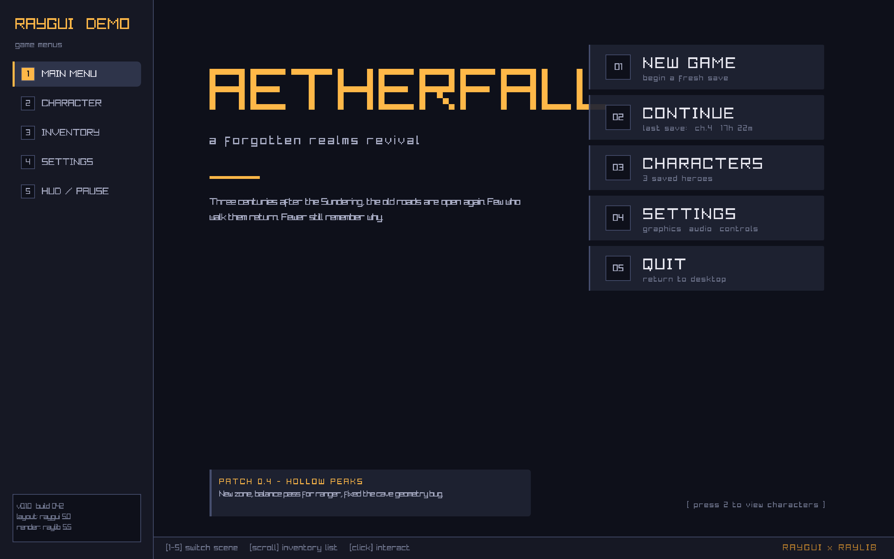
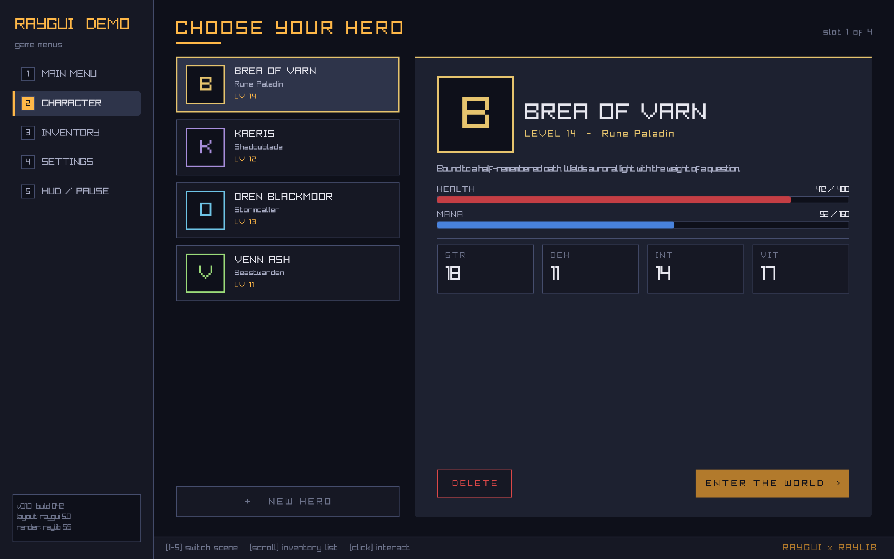
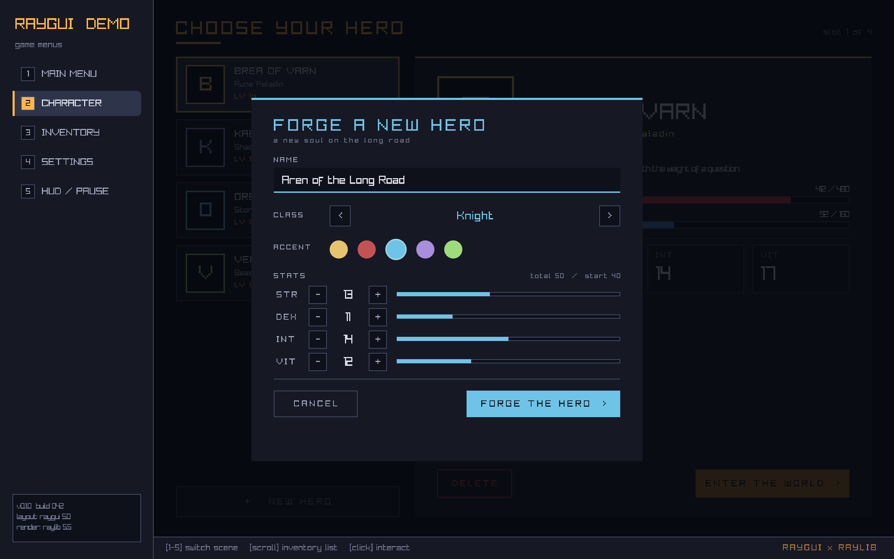
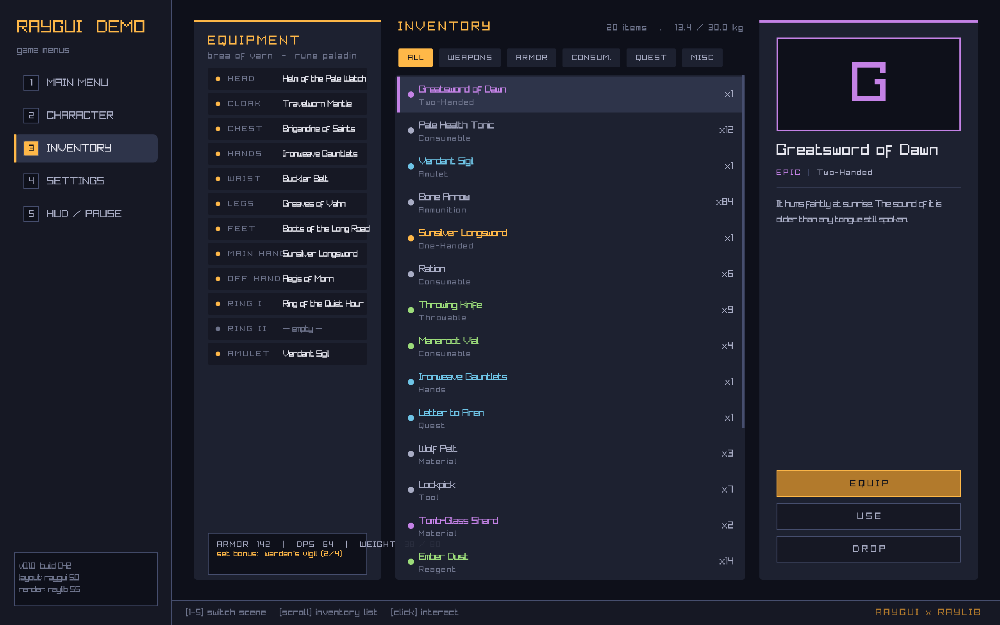
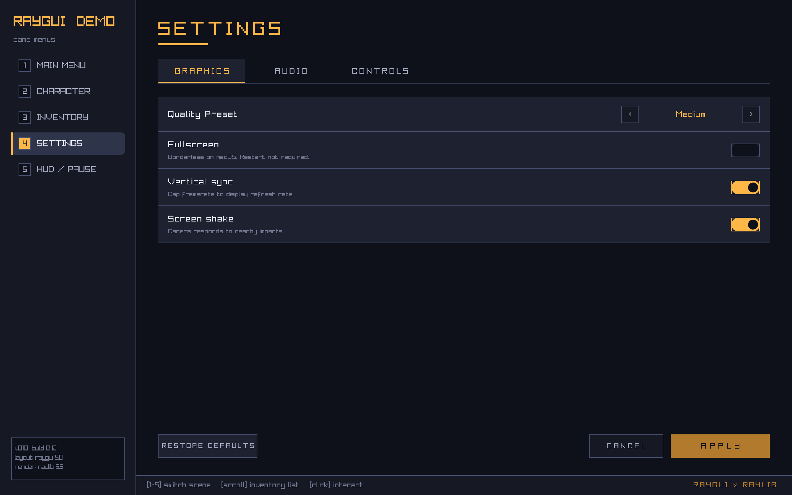
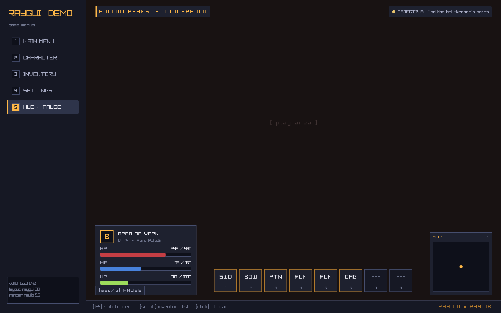

# raygui Game Menus

> A demo of [**raygui**](https://github.com/raysan5/raygui) — a single-header immediate-mode GUI library for raylib — building a complete set of interactive game menus.

<p align="center">
  
</p>

A port of the [`clay-ui`](../clay-ui) demo to raygui. Five fully-interactive scenes plus a modal form, in the same shared style. Hover, click, scroll, text input, floating overlays, scroll containers, tabbed views — most of what raygui + raylib needs to put on screen for a game's front-end.

## Scenes

<table>
  <tr>
    <td width="50%"><strong>1. Main menu</strong><br/></td>
    <td width="50%"><strong>2. Character select</strong><br/></td>
  </tr>
  <tr>
    <td><strong>* Forge a new hero (modal)</strong><br/></td>
    <td><strong>3. Inventory</strong><br/></td>
  </tr>
  <tr>
    <td><strong>4. Settings</strong><br/></td>
    <td><strong>5. HUD / pause</strong><br/></td>
  </tr>
</table>

| # | scene             | demonstrates |
|--:|-------------------|---|
| 1 | Main menu         | typography hierarchy, hover accent bars, info strips |
| 2 | Character select  | data-driven cards, click selection, stat bars per slot |
| 3 | Inventory         | scroll container with scissor clipping, filter pills, rarity colour |
| 4 | Settings          | tabbed sub-views, sliders, toggles, steppers, key-binding rows |
| 5 | HUD / pause       | layered HUD over a play space, floating pause overlay |
| * | Forge a new hero  | a modal form: text input, class stepper, accent swatches, stat allocator |

## Run

```bash
brew install raylib   # macOS, one-time
./run.sh
```

`run.sh` builds incrementally and execs the binary. Tested on macOS 14+ / Apple Silicon with Raylib 5.5 and raygui 5.0. raygui is vendored as a single header (`vendor/raygui.h`).

## Controls

| | |
|---|---|
| `1`-`5` (or click the sidebar) | switch scene |
| **Click** | interact with anything that hovers |
| **Scroll** | scroll the inventory list |
| `ESC` / `P` on the HUD | toggle pause |
| `ESC` in the new-hero form | cancel |
| Typing | enters the hero name field when the form is open |

## How it's wired

raygui is an *immediate-mode* GUI library, in contrast to Clay's declarative layout engine. Everywhere clay-ui says "give me a flexbox column with `childGap = 8`," raygui needs an explicit `Rectangle` per widget. The trade is more arithmetic per scene in exchange for zero layout-engine state.

The drawing model is also flatter: there are no render commands, no layout pass — every `UI_Panel(...)`, `GuiSliderBar(...)`, `DrawText(...)` issues straight to raylib's frame.

```c
SetConfigFlags(FLAG_VSYNC_HINT | FLAG_WINDOW_RESIZABLE | FLAG_MSAA_4X_HINT | FLAG_WINDOW_HIGHDPI);
InitWindow(1280, 800, "raygui Game Menus");

while (!WindowShouldClose()) {
    BeginDrawing();
        ClearBackground((Color){ 12, 12, 18, 255 });

        Rectangle sidebar = { 0, 0, 220, sh };
        Rectangle scene   = { 220, 0, sw - 220, sh - 32 };
        Rectangle footer  = { 220, sh - 32, sw - 220, 32 };

        switch (state.scene) {
            case SCENE_MAIN_MENU: Scene_MainMenu(&state, scene); break;
            /* ... */
        }
        Sidebar(&state, sidebar);
        Footer(footer);
    EndDrawing();
}
```

Patterns worth a look:

- **Hover** — `UI_Hovered(rect)` is just `CheckCollisionPointRec(GetMousePosition(), r)` gated by a "modal active" latch. Switching background/border colours on hover is one ternary in the draw call.
- **Click handling** — `if (UI_Hovered(r) && IsMouseButtonPressed(MOUSE_BUTTON_LEFT))` per widget, inline with its draw.
- **Scroll** — `BeginScissorMode(...)` clips the list rect; rows are drawn with a `-state->inventoryScroll` y-offset. A small thumb on the right is drawn from the same offset.
- **Modals / overlays** — a `g_modalActive` flag in `ui.c` makes the base layer's `UI_Hovered` return false while the modal is up, so the form and the pause overlay automatically eat all clicks beneath them.
- **Dynamic text** — `UI_Fmt(...)` writes to a per-frame string arena (`src/ui.c`) so format-strings can be drawn directly without a heap allocation.

## Project layout

```
src/
  main.c       entry, scene dispatcher, raylib glue, screenshot mode
  ui.h / ui.c  palette, sidebar, footer, StatBar, panel/text primitives, frame string arena
  scenes.c     five scenes + the new-hero form

vendor/
  raygui.h     raygui 5.0 (single header)

scripts/
  capture.sh   regenerate the screenshots in this README
```

## Reproducing the screenshots

The binary recognises three environment variables for non-interactive captures (no manual screenshotting needed):

| variable             | meaning |
|----------------------|---|
| `RAYGUI_SCREENSHOT`  | basename of the PNG to write; the app exits a few frames after writing |
| `RAYGUI_SCENE`       | start in scene `0`-`4` (main / character / inventory / settings / hud) |
| `RAYGUI_FORM=1`      | open the new-hero form (meaningful with `RAYGUI_SCENE=1`) |

```bash
RAYGUI_SCENE=1 RAYGUI_FORM=1 RAYGUI_SCREENSHOT=hero.png ./build/raygui-menus
```

`scripts/capture.sh` regenerates everything in `docs/assets/` in one go.

## License

raygui and raylib are both [Zlib](https://opensource.org/license/zlib)-licensed. The demo code is yours to copy.
